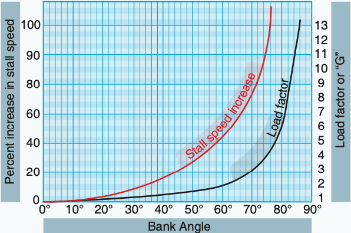

# Estimating the state of an airborne glider aircraft
Flying gliders is all about energy management. Taking off requires energy from an external source, be it a towplane, a winch or a slingshot. When airborne it's all about managing the potential energy in the aircraft. Thermals increase it. Some of it is traded for forward velocity, while sometimes it is purposely bled off through friction, for example by using airbrakes, or the split manoeuvre. Eventually when landing the goal is to touch down with the least amount of energy possible left. 

This document is about using the lift equation to model the flight dynamics of a glider. Potential applications for such a model are flight and risk analysis. The ultimate goal is to be able to model the energy in an aircraft based on parameters which are already publicly available, if not even in realtime. This information is generally reported over ADS-B and FLARM systems.

## Model inputs
The most straightforward information we are able to get consists of a position and a timestamp. The position should at least contain latitude, longitude and altitude. From this information we are able to derive the aircrafts ground speed, climbrate and turnrate, which will be used as input into the following model as well.

## The Lift Equation
Using the lift equation we're already able to substitute some of it's arguments for assumptions based on the inputs provided earlier.


In this case we will have to use the reported ground speed as a slightly inaccurate proxy for the true air speed. We can also substitute the density with a default value of 1013.25hPa.

> There are various ways to reduce the error on these assumptions. One is to embed weather information into this model as well. As for calculating the air speed another possibility is to find the inaccuracy of the lift equation for explaining the actual flight movements, and attributing this (average) error as wind component.

The two unknowns at this point are the lift coefficient and the wing area. What we know about the wing area is that its input in the equation changes during a turn as the effective wing area becomes smaller against the gravity component; the resulting lift will be lower.

These two components, the lift coefficient and the wing area are two unknowns. Although we can go look for the wing area for each individual aircraft, it would be much more effective to try and approximate this value. In order to achieve this we'd have to jump through a few hoops.

*See also [Calculating the kinetic energy for a glider](./kinetic-energy).*


### Calculating the amount of kinetic energy
The amount of kinetic energy can be calculated with the following formula: $Ek = 0.5\cdot m \cdot v^2$ . Given we do not know about the mass of the aircraft we're moving this parameter to the left hand side of the equation resulting in the following formula: $\frac {Ek}{m}=0.5\cdot v^2$, so we start calculating the kinetic energy by unit of mass. Once we know the actual mass of the aircraft we can multiply this value by the mass in order to get the absolute amount of kinetic energy.

There are two primary vectors representing the amount of kinetic energy;
1. (Forward) velocity
2. Climbrate

By adding these two vectors up to each other we get the total amount of kinetic energy per mass unit.

We're assuming an aircraft can't fly sideways. Although possible this isn't part of normal operating procedures, and therefore I will simply skip over this part.

### Using the climbrate in the lift equation
If we want to base further equations on the lift equation we have to solve certain parameters in order to create an accurate estimation. The climbrate is the closest we will get to a measured amount of lift, and therefore we'll try to use this value to create a closely derived parameter. The climbrate is expressed in $m\cdot s^{-1}$, though the amount of lift is expressed in Newtons, or $kg\cdot m\cdot s^{-2}$.

> The gravitation constant ($g=9.80665\ m/s^2$) exerts a force of about 9.8 newtons. Therefore in order to compensate for the pull of gravity we'll need a lift force of at least 9.8N/kg before an aircraft can sustain flight. To climb we'll need more, to descent we'll need less.
> The implication is that a sink/climbrate of $0\ m/s$ implies a lift force of $9.81\ N/kg$ when airborne.

See [Substituting part of the lift equation with the climbrate](./using-climbrate-in-the-lift-equation) for further details on the matter. The formula we end up with is $a = Cl\ \frac {r\ V^2} 2 A\ m^{-1}$.


### Dealing with the lift coefficient
There is still one unknown parameter left in the lift formula, which is the lift coefficient. This is a dimensionless number which captures several different factors such as the form of the airfoil as well as the angle of attack. For the remainder of this article we'll assume that the airfoil does not change (an assumption which does not hold for aircraft using flaps), and that changes to the lift coefficient are primarilly a result of a change of the angle of attack, which mostly reflects a change in airflow.

> Changes in airflow are very broadly defined, but I'm primarilly thinking about thermals, or turbulence. Such airflows will naturally result in a change of the angle of attack, which must be reflected within the lift coefficient.

See ["solving the lift coefficient"](./solving-the-lift-coefficient) for more background.

### Calculating the bank angle
As soon as the aircraft starts turning we'll see a divergence to the lift coefficient which we'll not be able to attribute solely to the change in speed or airflow. We're dealing here with a side effect of turning, where the effective wing area gets smaller with a higher bank angle.

In order to try to compensate for this effect we'll try to derive the bank angle from the turnrate. Starting point is the ['stardard rate turn'](https://en.wikipedia.org/wiki/Standard_rate_turn#Angle_of_bank_formula) which assumes a coordinated turn.

The formula to calculate the bank angle is as follows;

$$
\unicode{8960}=arctan\ \frac {v^2_t} {rg}
$$

What we're missing from this formula is the radius. Given the turnrate reflects the number of turns in a minute, the radius can be calculated from the distance traveled in a minute. With a velocity of `80 km/h (22.22 m/s)` this would result in a distance travelled of `1333.2 meters`. This value should be multiplied by the turns/minute value. Assuming `1 turn/minute`, the resulting formula would be `1333.2/(2pi)`, with a resulting value (radius) of `212.185 meters`.

Evaluating this in Mathematica:

```mathematica
ArcTan[22.22^2/(212.18537013011488*9.81)]
```

Results in a bank angle of `0.23289` radians which is $\frac {0.23289}{(\frac {pi} {180})}=13.3436$ degrees.


*15 degrees for context*

### Calculating the lift ratio based on the turnrate
Now that we have the turnrate we can calculate the load factor, which is required to calculate the increase in stallspeed and hence the reduction of lift. To get there we'll first calculate the load factor:
$$
n\ =\ \frac {1} {cos\ θ}
$$
*Load factor calculation where θ is the bank angle in radians, and n is the load factor.*

[According to Wikipedia](https://en.wikipedia.org/wiki/Load_factor_(aeronautics)):

> "A load factor greater than 1 will cause the stall speed to increase by a factor equal to the square root of the load factor. For example, if the load factor is 2, the stall speed will increase by about 40%."

Continuing with the previous situation where we're making 1 turn/minute at 22.22 meters/second this will bring us to:

```mathematica
Sqrt[1/Cos[0.23289]] = 1.01378
```

Which thus results in a 1.4% increase in stall speed at a 13° bank angle.

Plotting the bank angle on the x axis vs the increase in stall speed on the y axis results in the following chart:



```mathematica
Plot[Sqrt[1/Cos[(Pi/180) x]], {x, 0, 90}]
```

At 84° we're talking about a stall speed increase of 300%. At 90° we should be talking about rocket physics instead.

(See also [http://www.nature1st.net/soarns/crclmotn.html](http://www.nature1st.net/soarns/crclmotn.html))
