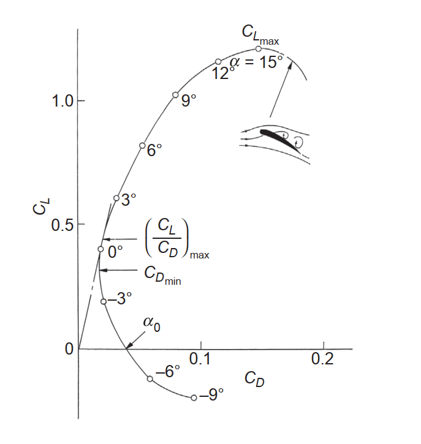

Taking [the formula resulting from embedding acceleration into the equation](./using-climbrate-in-the-lift-equation), we can attempt to solve the $Cl$ parameter.

$$
a = Cl\ \frac {r\ V^2} 2 A\ m^{-1}
$$

In this formula there are still a number of unknowns. Depending on the context for which we're trying to solve $Cl$ we can make a number of assumptions helping us to constrain the value to a reasonable number.

> Though wing area $A$ is constant, we're not always using the same value for $A$, for example when in a turn. But since this can all be derived from position information we're treating $A$ as a constant anyway.

## Dealing with density
For density we can get by with the default value of 1013.25 hPa. We can gradually improve accuracy, depending on the situation in which this becomes necessary.

The first accuracy improvement is to [calculate the theoretical pressure at the reported height of the aircraft](https://en.wikipedia.org/wiki/Pressure_altitude#Inverse_equation);

$$
p = 1013.25\ exp\left( \frac {-h} {8431\ m} \right) hPa
$$

If this is not accurate enough it is always possible to replace the default pressure with the current QNH for a location nearby.

To further improve upon this approximation it is also possible to load in information from a current weather model and take the predicted value at the current position of an aircraft. It should be noted however that - especially for an approximation - this starts to become a plateau of diminshing returns. A benefit of using a weather model however is that we can change the observed ground speed with an approximation of the true air speed.

## When knowing the specific aircraft
Knowing something about the aircraft being observed makes life significantly easier as we'd be able to look up the wing area, as well as the empty and maximum take off weights. The latter constrains the range of values we can work with.

Additionally it gives us information about the capabilities of the aircraft; how many factors possibly impact the $Cl$ parameter?

Even better is if there is already a $Cl$ profile available such as the one below. This would facilitate a simple lookup, the results of which give further insight about the aircraft, such as the current angle of attack.

  
*Lift coefficient vs drag coefficient [^1]*

## When dealing with gliders
In the context of solving the lift equation for $Cl$, doing so for gliders is possibly the least complex of all. The reasons for this are:
- Gliders have a fixed wing area $A$
- As most gliders do not have flaps, changes to $Cl$ can largely be attributed to a change in the angle of attack
- As gliders do not consume fuel, mass $m$ stays constant throughout the flight as well. With the side note this does not apply in situations when water ballast is used.

For the time being this allows us to substitute the mass and wing area parameters with constant value $1$. The only thing changing throughout the flight then is $Cl$.

With everything else staying constat, we know that a change in the $Cl$ parameter is due to a change in the angle of attack. That is, unless flying sideways. In that case we're introducing a significant amount of drag, generally meant to reduce the amount of potential energy. That is not something we're going to model in here though.

## Iterative approximation of the lift coefficients
While generally much detailed information is unknown about the aircraft, for most fixed wing glider aircraft the lift coefficients are supposed to remain consistent with a change in the angle of attack. Shifting around the parameters in the lift equation such that all known factors are on one end, and the unknown are on the other end, we end up with the following:

$$
\frac {Cl} m = \frac {2a} {A r V^2}
$$

If we would use this formula to get an intermediary value for the lift equation, this would likely be a ridicuously large number, not at all representative of the actual lift coefficient. If we do however divide this number by the mass of the aircraft we will get actual lift coefficients back.

On its own this isn't all that useful. But, if we either know the actual lift coefficient, or we have the mass of the aircraft to calibrate against, we can work out either of these.

Concretely, the implication is that during a flight we can start to approximate the mass of the aircraft if we know the lift coefficients for a given aircraft. The other way around works as well. If we know the mass of an aircraft for a given flight - as some sort of calibration - we can work out the lift coefficients for various manuouvres as well.

[^1]: Nakayama, Yasuki. “Introduction to fluid mechanics.” Butterworth-Heinemann (2018): 177 – 200
