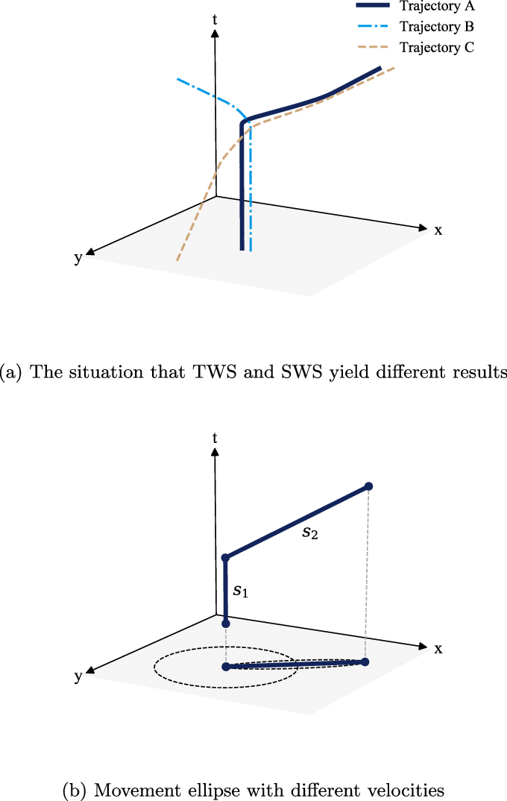

> This algorithm is based on the paper ["High Performance Spatiotemporal Trajectory Matching Across Heterogeneous Data Sources"](/notes/papers/high-performance-spatiotemporal-trajectory-matching-across-heterogeneous-data-sources).

### Overview
The algorithm contains 3 important formulas to match heterogenous data feeds. These functions are:

1. A similarity function reflecting the relatedness of two points.
2. A Time Weighted Similarity (TWS) to reflect the temporal similarity between two sets.
3. A Space Weighted Similarity (SWS) to reflect the spatial similarity between two sets.

It is possible for TWS and SWS to independently match a on different portion of the path, as shown in figure 5a from the paper, also shown below;

An important distinction between the similarity function and the TWS and SWS functions is that the similarity function checks the similarity between two points based on the euclidean distance and point variance. Though the TWS and SWS functions use the similarity function within, *their task is to compare sets, instead of individual points*.

> The previous remark has the implication that this should be reflected within an implementation. As such;
> - The similarity function should require individual data points as argument.
> - The SWS and TWS functions should require sets as arguments.

1. **Similarity**:
	A method calculating similarity of two points based on the Euclidean distance and point variance. [Point similarity](./point-similarity)
1. **TWS (Time Weighted Similarity)**:
	A function calculating the similarity of two sets of points based on the temporal distance. [Time weighted Similarity (TWS)](./time-weighted-similarity)
3. **SWS (Space Weighted Similarity)**:
	A function calculating the similarity of two sets of points based on their spatial distance. [Space Weighted Similarity (SWS)](./space-weighted-similarity)
