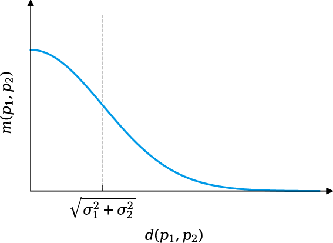

> Linked to from ["High Performance Spatiotemporal Trajectory Matching"](./index).

# Point Similarity

Point similarity is defined as being:

$$
m(p_1,p_2)=\frac {1} {2\pi(σ_1^2+σ_2^2)}\ \exp{\left \{ -\frac{d(p_1,p_2)^2}{2(σ_1^2+σ_2^2)}\right \}}
$$

Whereas;

$d(.,.)$ is the distance between 2 points. [Euclidean distance](../euclidean-distance)
$p$ is the 2 or 3 dimensional coordinate.
$σ$ is the measurement deviation


*The relationship between the euclidean distance (X), and the similarity function (Y).*

## Normalization
To normalize the similarity between 0 and 1, the result needs to be divided by the maximum value. As similarity decreases with increased distance, the highest value occurs with an exact match. Simplifying the formula for this condition results in;

$$
M_{max}=\frac {1} {2\pi(σ_1^2+σ_2^2)}
$$

> As $M_{max}$ denotes the first part of the similarity equation, its workings become more clear to the (mathematically) uneducated mind. What happens in the similarity function is that the maximum value is multiplied by an increasingly small number, which depends both on the distance as well as the measurement variance.

## Implementation
My implementation in C# looks as follows:

```csharp
public static double CalculatePointSimilarity(
    ISpacetimePoint p1,
    ISpacetimePoint p2,
    double variance1 = 0.3,
    double variance2 = 0.3)
{
    // This is a significant simplification of the `similarityFunction` to determine the maximum value of a similar point for the given variances.
    static double maxValue(double variance1, double variance2)
	    => 1 / (2 * Math.PI * ((variance1 * variance1) + (variance2 * variance2)));

    var max = maxValue(variance1, variance2);

    double similarityFunction(
        ISpacetimePoint p1,
        ISpacetimePoint p2,
        double variance1,
        double variance2) => max * (Math.Exp(-(Math.Pow(Distance(p1, p2), 2) / (2 * ((variance1 * variance1) + (variance2 * variance2))))));

    var score = similarityFunction(p1, p2, variance1, variance2);
    return score / max;
}
```
*Embedding mathematical functions within inline functions is a personal preference to make navigating and refactoring code like this easier.*
